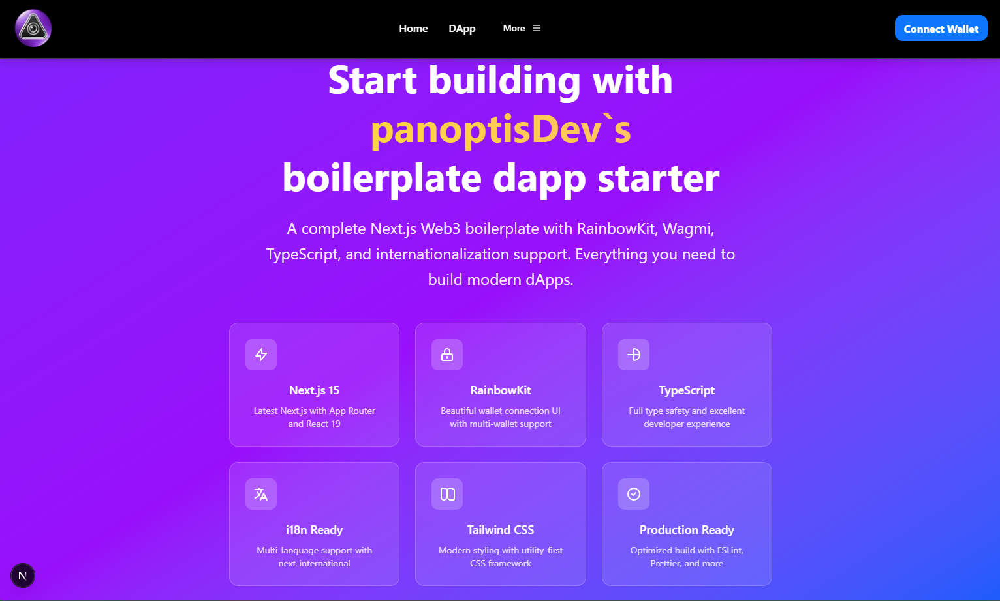

# PanoptisDev EVM Starter


A modern and opinionated Next.js starter template for EVM-based Web3 applications with internationalization support and best development practices preconfigured.

## ✨ Features

- 🌐 **Multi-language Support** - Built-in internationalization (English & Chinese)
- 🔗 **Web3 Integration** - RainbowKit + Wagmi + Viem for seamless blockchain connectivity
- 🎨 **Modern UI** - shadcn/ui components with Tailwind CSS v4 and OKLCH colors
- ⚡ **Next.js 15** - Latest Next.js with React 19 and Turbopack for fast development
- 🛠 **Developer Experience** - TypeScript, Biome, Husky, and lint-staged preconfigured
- 📱 **Responsive Design** - Mobile-first approach with beautiful animations

## 🚀 Tech Stack

### Frontend
- **Framework:** [Next.js 15](https://nextjs.org/) with React 19
- **UI Components:** [shadcn/ui](https://ui.shadcn.com/) with [Radix UI](https://www.radix-ui.com/)
- **Styling:** [Tailwind CSS v4](https://tailwindcss.com/) with OKLCH color system
- **Icons:** [Lucide Icons](https://lucide.dev/)
- **Animations:** [Motion](https://motion.dev/)

### Web3 & Blockchain
- **Wallet Connection:** [RainbowKit](https://www.rainbowkit.com/)
- **Ethereum Library:** [Wagmi](https://wagmi.sh/) + [Viem](https://viem.sh/)
- **State Management:** [TanStack Query](https://tanstack.com/query)

### Internationalization
- **i18n Framework:** [next-international](https://next-international.vercel.app/)
- **Supported Languages:** English (en), Chinese (cn)
- **Automatic Detection:** Browser language detection with fallback

### Development Tools
- **Type Safety:** [TypeScript](https://www.typescriptlang.org/)
- **Code Quality:** [Biome](https://biomejs.dev/) for formatting and linting
- **Git Hooks:** [Husky](https://typicode.github.io/husky/) + [lint-staged](https://github.com/lint-staged/lint-staged)

## 🏁 Getting Started

### Installation
   ```bash
   nvm use 20.19.2
   yarn install
   yarn dev
   ```
1. **Clone the repository:**
   ```bash
   git clone https://github.com/panoptisDev/evm-starter-boilerplate-next-dapp-wagmi-rainbowkit-25-07.git
   cd evm-starter-boilerplate-next-dapp-wagmi-rainbowkit-25-07
   ```

2. **Install dependencies:**
   ```bash
   bun install
   ```

3. **Environment setup:**
   ```bash
   cp .env.example .env
   ```
   
   Add your WalletConnect Project ID:
   ```env
   WALLET_CONNECT_PROJECT_ID=your_project_id_here
   ```

4. **Start development server:**
   ```bash
   bun dev
   ```

5. **Open your browser:**
   Navigate to `http://localhost:3000`

## 📁 Project Structure

```
src/
├── app/
│   └── [locale]/              # Internationalized routes
│       ├── layout.tsx         # Root layout with i18n provider
│       ├── page.tsx           # Landing page with hero section
│       └── dapp/              # DApp section
│           ├── layout.tsx     # DApp layout with Web3 providers
│           └── page.tsx       # DApp page with wallet connection
├── components/
│   ├── ui/                    # shadcn/ui components
│   │   └── dropdown-menu.tsx  # Dropdown menu component
│   ├── wed/                   # Custom UI components
│   │   └── button.tsx         # Custom button component
│   ├── navbar.tsx             # Main navigation bar (with Web3)
│   ├── landing-navbar.tsx     # Landing page navbar (without Web3)
│   ├── client-web3-provider.tsx # Client-side Web3 provider wrapper
│   ├── web3-provider.tsx      # Web3 context provider
│   └── toggle-language.tsx    # Language switcher component
├── hooks/
│   └── use-ripple.ts          # Custom ripple effect hook
├── lib/
│   └── utils.ts               # Utility functions and class merging
├── locales/
│   ├── client.ts              # Client-side i18n configuration
│   ├── server.ts              # Server-side i18n configuration
│   ├── index.ts               # i18n utilities and locale helpers
│   └── languages/             # Translation files
│       ├── en-US.ts           # English translations
│       └── zh-CN.ts           # Chinese translations
├── styles/
│   └── globals.css            # Global styles and Tailwind imports
└── middleware.ts              # i18n routing middleware
```

## 🔧 Available Scripts

- `bun dev` - Start development server with Turbopack
- `bun build` - Build production bundle with format & lint
- `bun start` - Start production server
- `bun format` - Format code with Biome
- `bun lint` - Lint code with Biome

## 📝 License

This project is licensed under the MIT License - see the [LICENSE](LICENSE) file for details.

## 🙏 Acknowledgments

- [Next.js](https://nextjs.org/) - The React Framework for Production
- [RainbowKit](https://www.rainbowkit.com/) - The best way to connect a wallet
- [Wagmi](https://wagmi.sh/) - React Hooks for Ethereum
- [Viem](https://viem.sh/) - Ethereum library for JavaScript
- [Tailwind CSS](https://tailwindcss.com/) - A utility-first CSS framework
- [shadcn/ui](https://ui.shadcn.com/) - Beautiful and accessible components
- [next-international](https://next-international.vercel.app/) - Type-safe internationalization
- [Biome](https://biomejs.dev/) - Fast toolchain for web projects